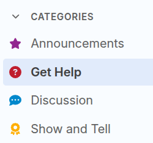
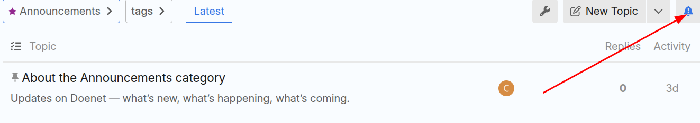

# Using Doenet's Community Discussions

One way to engage with Doenet's community is to use our [Community Discussions](http://community.doenet.org).
The discussions use the same accounts as [beta.doenet.org](https://beta.doenet.org) to make it
easy to join in the discussion.

## The main discussion categories

Community discussions has four main categories

1. **Announcements**. A low traffic category that Doenet organizers use for announcements to the whole community.
Unlike all other categories, everyone is, by default, "watching" the announcement category,
which means they will receive a notification for each new post.
See [Changing the notification level](#changing-the-notification-level) to adjust the notification level.

2. **Get Help**. Here's where you can ask a question or search for answers to previous questions.

3. **Discussion**. Our general forum for discussing ideas about Doenet, requesting a feature,
or exploring what's going on in the Doenet community.

4. **Show and Tell**. You can create short posts here with a link to your activity to alert the community about something you've been working on.

## Changing the notification level

By default, you will receive notifications for the occasional posts to the Announcement category.
For other posts, you will receive a notification only if someone replies to your post or mentions your @name.

To change the notification level for a category, click the bell icon in the upper right corner while viewing a category,
as shown below.

The most common options for notification level are:

- **Watching** (default for Announcements). You will receive a notification for every post.
- **Tracking** (default for everything else). You won't receive a notification unless someone replies to your post
  or mentions your @name. In the Community Discussions page itself, it will display a dot for categories
  or tags with new activity.
- **Watching first post**. Like Watching, except you get a notification only for new topics, not for replies to existing topics.
  (You also get notified if someone replies to you or mentions your @name).
