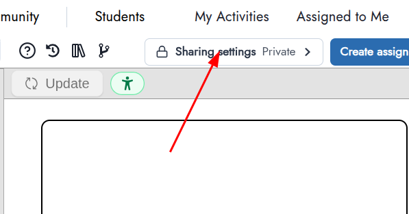
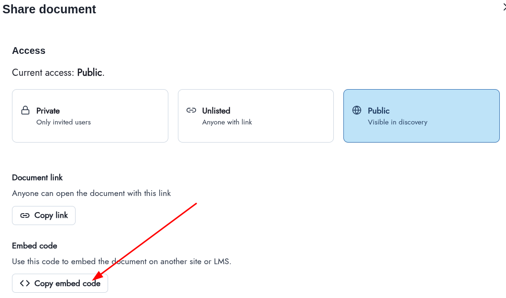
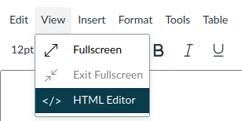

import { DoenetViewer, DoenetEditor, DoenetExample } from "../../components"
import { AttrDisplay, PropDisplay } from "../../components"

# Embed Doenet Activities in Canvas

Follow these steps to embed a copy of a Doenet activity into a Canvas assignment or page.
With this approach students scores or progress are not saved, but they can interact
with the Doenet activity from within the Canvas course.

## Copy the Embed code from Doenet

1. Open your activity
2. Click on Share settings

3. Make sure the activity is Unlisted or Public
4. Click the Copy embed code button

## Copy the embed code to Canvas

1. When editing a Canvas assignment or page, click the View menu above the large input box and select Html Editor.

2. Paste the embed code copied above into the the large input box.

