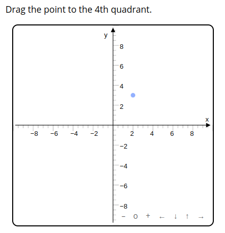

# DoenetML

Semantic markup for building interactive web activities.
[Read more about Doenet](https://www.doenet.org)

```xml
<p>Drag the point to the 4th quadrant.</p>
<graph>
    <point xs='2 3'/>
</graph>
```



## Features

-   Internally manages a directed acyclic graph of dependencies to coordinate updates of self-referential worksheets

## Quick Start

In the project folder:

`$ npm install`

`$ npm run dev`

Paste demo code into `packages/test-viewer/src/test/testCode.doenet`

Navigate to `localhost:5173`


## Development

### Publishing

Run
```bash
npm run build
```
to make a publishable package in the `./dist` directory. As part of the build process a stripped
down version of `package.json` is copied into the `./dist` directory. **This** is the package that you should publish.
I.e., do a `cd ./dist` before publishing.
