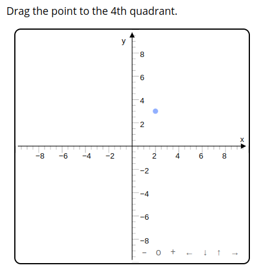

# DoenetML

Semantic markup for building interactive web activities.
[Read more about Doenet](https://www.doenet.org)

```xml
<p>Drag the point to the 4th quadrant.</p>
<graph>
    <point xs='2 3'/>
</graph>
```



## Features

-   Internally manages a directed acyclic graph of dependencies to coordinate updates of self-referential worksheets

## Quick Start

In the project folder:

`$ npm install`

`$ npm run dev`

Paste demo code into `packages/test-viewer/src/test/testCode.doenet`

Navigate to `localhost:5173`

## Development

### PreFigure Renderer Configuration

When using `renderer="prefigure"` on a graph, the viewer may load an external
diagcess script and call a prefigure build endpoint. Both URLs are configurable
via Vite environment variables:

- `VITE_PREFIGURE_BUILD_ENDPOINT`
- `VITE_PREFIGURE_DIAGCESS_SCRIPT_URL`
- `VITE_PREFIGURE_MODULE_URL`
- `VITE_PREFIGURE_INDEX_URL`

If not provided, defaults are used from
`src/Viewer/renderers/utils/prefigureConfig.ts`.

### CSP Notes for PreFigure Renderer

If your deployment enforces Content Security Policy, ensure the hosts for your
configured prefigure endpoints are allowed:

- `script-src` should allow `VITE_PREFIGURE_DIAGCESS_SCRIPT_URL` host
- `connect-src` should allow `VITE_PREFIGURE_BUILD_ENDPOINT` host

With defaults, this corresponds to:

- `script-src https://cdn.jsdelivr.net`
- `connect-src https://prefigure.doenet.org`

### Publishing

Run

```bash
npm run build
```

to make a publishable package in the `./dist` directory. As part of the build process a stripped
down version of `package.json` is copied into the `./dist` directory. **This** is the package that you should publish.
I.e., do a `cd ./dist` before publishing.
